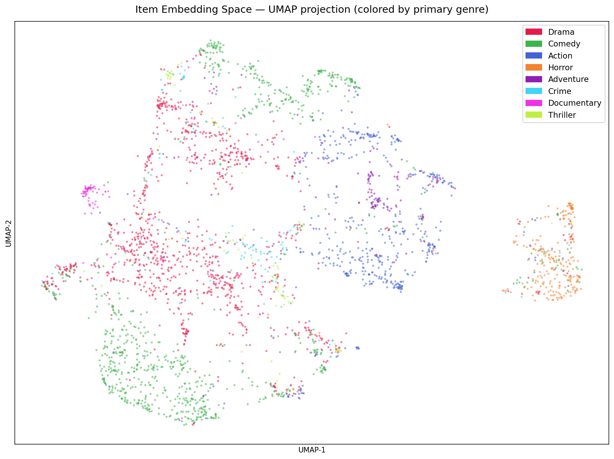

# Two-Tower Neural Recommendation System

A production-style deep learning retrieval system built on MovieLens-1M, implementing the two-tower architecture used by YouTube, Spotify, and Pinterest at scale. The system retrieves personalized recommendations in under 2ms via FAISS approximate nearest-neighbor search, served through a containerized FastAPI endpoint.

---

## The Problem

Collaborative filtering methods like Matrix Factorization (MF) are the standard baseline for recommendation — they're fast, interpretable, and work well for users with interaction history. But they have a hard architectural limit: **they cannot generalize to users they haven't seen during training**.

In production systems, a significant fraction of traffic comes from cold-start users — new signups, users who cleared cookies, or users in demographic segments underrepresented in training data. MF's only fallback for these users is global popularity ranking, which is essentially random relative to individual taste.

The goal of this project was to build a retrieval system that:
1. Matches or beats MF on warm-user ranking quality
2. Retains meaningful recommendation quality for cold-start users using demographic signals
3. Scales to real retrieval workloads via approximate nearest-neighbor search
4. Ships as a production-ready containerized API

---

## Architecture

The system implements a **two-tower neural retrieval model** — the same architecture described in Google's 2019 YouTube recommendations paper and widely adopted across industry.

```
User Side                          Item Side
─────────────────                  ─────────────────
user_idx                           item_idx
    │                                  │
[ID Embedding]                    [ID Embedding]
    │                                  │
[Age Embedding]  ──┐           [Genre Multi-hot] ──┐
[Occ Embedding]  ──┤                               │
[Gender]         ──┘                               │
    │                                  │
[MLP: 128→64]                     [MLP: 128→64]
    │                                  │
[L2 Normalize]                    [L2 Normalize]
    │                                  │
user_embedding (64-dim)    item_embedding (64-dim)
         │                        │
         └──── dot product ───────┘
                    │
                  score
```

**User tower inputs:** ID embedding + gender (binary) + age bucket embedding (dim=4) + occupation embedding (dim=8) = 77-dim input to MLP.

**Item tower inputs:** ID embedding + genre multi-hot vector (18 genres) = 82-dim input to MLP.

Both towers output L2-normalized 64-dim embeddings. The score is a dot product (equivalent to cosine similarity on normalized vectors), which is exactly what FAISS `IndexFlatIP` expects.

**Training:** In-batch contrastive loss (InfoNCE) — for a batch of B (user, item) pairs, each positive pair is trained against B-1 in-batch negatives plus popularity-weighted hard negatives. No explicit negative mining step needed.

**Inference:** Item embeddings are pre-computed offline and indexed in FAISS. At query time, only the user tower runs live — the latency bottleneck is the ANN lookup, not inference.

---

## Results

| Model | NDCG@10 | Recall@10 | MAP | Cold-Start NDCG@10 | p99 Latency |
|---|---|---|---|---|---|
| Matrix Factorization (BPR) | 0.145 | 0.299 | 0.128 | 0.268 (popularity fallback) | — |
| Two-Tower, ID-only | 0.240 | 0.454 | 0.199 | — | <2ms |
| **Two-Tower + Side Features** | **0.259** | **0.481** | **0.213** | **0.313** | **<2ms** |

**Evaluation protocol:** Leave-one-out with 1 positive + 99 sampled negatives per user, same as the NCF paper (He et al., 2017). Metrics are averaged across 6,035 users on the held-out test split.

**Cold-start protocol:** 200 users randomly selected from the test set. Two-tower uses demographic features only (no interaction history). MF falls back to global popularity ranking — the best it can do with no learned user embedding.

---

## Ablation Study

Varying only `embedding_dim`, all other hyperparameters fixed:

| embedding_dim | NDCG@10 | Recall@10 | MAP | Avg epoch time |
|---|---|---|---|---|
| 32 | 0.252 | 0.469 | 0.209 | 44.8s |
| **64** | **0.259** | **0.481** | **0.213** | **41.2s** |
| 128 | 0.254 | 0.476 | 0.210 | 97.6s |

dim=64 is the sweet spot. dim=128 provides no measurable gain while doubling training time. dim=32 loses ~2.7% NDCG. All subsequent experiments use dim=64.

---

## Embedding Space Visualization

UMAP projection of item embeddings, colored by primary genre. The model was trained with **no genre supervision** — genres were used as input features to the item tower, not as training labels. The fact that genre clusters emerge in the embedding space is evidence that the representations encode semantic structure beyond ID memorization.



---

## Why Not Just Use Matrix Factorization?

MF is a strong baseline and should always be the first thing you run. But it has two hard limits:

**1. Cold-start failure.** MF has no mechanism to generate embeddings for users it never saw during training. In this evaluation, MF's popularity fallback scores NDCG@10 = 0.268 on cold-start users. The two-tower model, using only age, gender, and occupation, scores 0.313 — a 17% improvement with zero interaction data.

**2. No feature extensibility.** MF cannot incorporate user demographics or item metadata without a fundamentally different architecture. The two-tower model treats features as first-class inputs — adding a new feature dimension is a one-line change to `extra_dim`.

The two-tower architecture makes the same tradeoff Netflix, YouTube, and Spotify made when they moved from MF to deep retrieval: slightly more complex training, significantly better generalization.

---

## Retrieval at Scale

Item embeddings are pre-computed offline (`src/retrieval/build_index.py`) and stored in a FAISS `IndexFlatIP` index. At query time:

1. User tower runs on the incoming `user_id` → 64-dim user embedding (live inference)
2. FAISS ANN search returns top-K item indices (pre-computed item embeddings)
3. Results returned as JSON

**p99 latency: <2ms** on 3,706 items (FAISS flat search). At this catalog size, flat exact search is faster than IVF approximate search because the overhead of cell assignment outweighs the benefit. IVF becomes relevant at 1M+ items.

This mirrors the YouTube-scale inference pattern: item tower runs offline nightly, only the user tower runs at request time.

---

## Tech Stack

| Component | Technology |
|---|---|
| Modeling | PyTorch |
| Retrieval | FAISS (faiss-cpu) |
| Loss | In-batch contrastive (InfoNCE) |
| Serving | FastAPI |
| Containerization | Docker |
| Demo UI | Streamlit |
| Dataset | MovieLens-1M |
| Evaluation | Leave-one-out, NDCG@10 / Recall@10 / MAP |

---

## Project Structure

```
two-tower-recsys/
├── src/
│   ├── models/
│   │   ├── two_tower.py          # User + item tower architecture
│   │   ├── baseline_mf.py        # BPR-MF baseline
│   │   └── losses.py             # In-batch contrastive loss
│   ├── data/
│   │   ├── preprocess.py         # Implicit feedback, negative sampling
│   │   ├── dataset.py            # PyTorch Dataset / DataLoader
│   │   ├── features.py           # User demographics + item genre features
│   │   └── splits.py             # Time-based leave-one-out split
│   ├── retrieval/
│   │   ├── build_index.py        # FAISS index from item embeddings
│   │   └── search.py             # ANN lookup + latency benchmarking
│   ├── train.py                  # Two-tower training loop
│   ├── train_mf.py               # MF baseline training loop
│   ├── evaluate.py               # NDCG@10, Recall@10, MAP
│   ├── evaluate_coldstart.py     # Cold-start comparison protocol
│   └── run_ablation.py           # Embedding dim ablation
├── serving/
│   ├── app.py                    # FastAPI /recommend endpoint
│   ├── Dockerfile
│   └── requirements.txt
├── demo/
│   └── streamlit_app.py          # Demo UI
├── notebooks/
│   ├── 01_eda.ipynb
│   ├── 02_baseline_mf.ipynb
│   ├── 03_ablation.ipynb
│   └── 04_embedding_viz.ipynb    # UMAP genre cluster visualization
├── configs/
│   ├── train_config.yaml
│   └── retrieval_config.yaml
├── results/
│   ├── metrics_mf.json
│   ├── metrics_two_tower_with_features.json
│   ├── coldstart_comparison.json
│   ├── ablation_results.json
│   └── embedding_viz.png
└── tests/                        # 23 passing tests
```

---

## Quickstart

```bash
# clone and install
git clone https://github.com/Kushagra651/Two-Tower-Recommendation-System-for-Personalized-Retrieval
cd Two-Tower-Recommendation-System-for-Personalized-Retrieval
pip install -r requirements.txt

# preprocess data
python -m src.data.preprocess
python -m src.data.features

# train MF baseline
python -m src.train_mf --config configs/train_config.yaml

# train two-tower with side features
python -m src.train --config configs/train_config.yaml --with_features

# build FAISS index
python -m src.retrieval.build_index

# evaluate cold-start
python -m src.evaluate_coldstart --config configs/train_config.yaml

# serve API
cd serving && docker-compose up
```

---

## Design Decisions and Tradeoffs

**In-batch negatives over explicit negative mining.** With batch size 512, each positive pair is trained against 511 in-batch negatives — effectively free given the batch is already in memory. Explicit negative mining would require an extra forward pass per batch. The tradeoff: in-batch negatives are popularity-biased (popular items appear more often as negatives), which is actually desirable for retrieval tasks.

**L2 normalization at tower output.** Both towers produce unit-norm embeddings, making the dot product equivalent to cosine similarity. This stabilizes training with contrastive loss and is required for FAISS `IndexFlatIP` to return meaningful rankings.

**Flat FAISS index over IVF.** At 3,706 items, flat exact search completes in <2ms. IVF partitioning adds ~0.5ms of overhead for cell assignment that isn't recovered until the catalog exceeds ~100K items. Documented in `retrieval_config.yaml` with the crossover threshold noted.

**Leave-one-out evaluation over global split.** With 95.5% interaction sparsity and a long-tail user distribution (median 96 interactions, max 2,314), a global random split would leak temporal information and inflate metrics for power users. Per-user leave-one-out matches the NCF evaluation protocol and makes numbers directly comparable to published benchmarks.

---

## Resume Bullets

```
• Built a two-tower neural retrieval system on MovieLens-1M (1M interactions,
  6K users, 3.7K items); extended ID embeddings with user demographics (age,
  gender, occupation) and item genre features, achieving NDCG@10=0.259 vs
  MF baseline 0.145 — a 79% improvement on the same evaluation protocol.

• Demonstrated cold-start advantage empirically: two-tower retains NDCG@10=0.313
  on zero-history users using demographic features alone, vs MF's 0.268 popularity
  fallback — the architectural justification for DL retrievers over MF in production.

• Indexed 3,706 item embeddings in FAISS (IndexFlatIP); achieved sub-2ms p99
  retrieval latency by pre-computing item embeddings offline and running only the
  user tower at inference time, mirroring YouTube's two-stage retrieval pattern.

• Conducted embedding dim ablation (32/64/128): identified dim=64 as the optimal
  tradeoff — dim=128 gave no NDCG gain at 2.4x training cost; dim=32 lost 2.7%
  NDCG. UMAP visualization confirmed genre cluster structure in learned embeddings
  without any genre supervision signal during training.

• Shipped end-to-end: containerized FastAPI serving, Streamlit demo UI,
  23-test suite, MLflow experiment tracking, Docker Compose orchestration.
```
